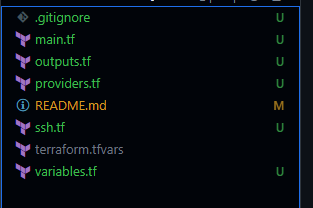
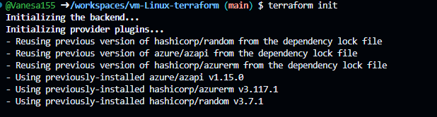
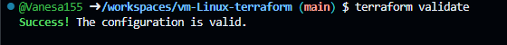
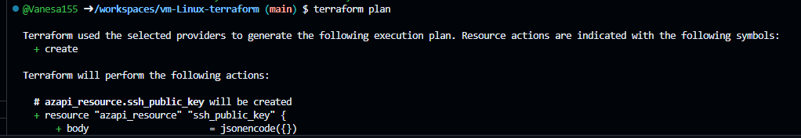
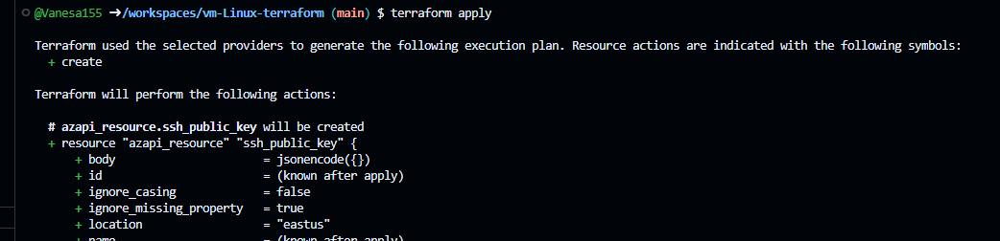
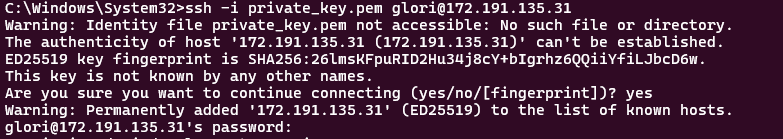
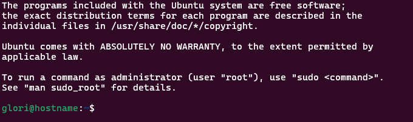

# Creación de una Máquina Virtual Linux en Azure con Terraform

## 📌 Descripción
Este proyecto implementa una **máquina virtual Linux en Azure** utilizando **Infrastructure as Code (IaC) con Terraform**. Se basa en la documentación oficial de Terraform, con las siguientes modificaciones:
1. Se agrega la variable `vm_name` para personalizar el nombre de la máquina virtual.
2. Se usa **SSH** para la autenticación en la VM, generando una clave pública y privada.
3. La clave privada de SSH y el archivo `terraform.tfvars` están **ignorados** en el `.gitignore` por seguridad.
4. El usuario de la VM se establece como `glori`.

---

## ⚙️ **Prerrequisitos**
Antes de ejecutar Terraform, asegúrate de tener instalado:

- [Terraform](https://developer.hashicorp.com/terraform/downloads)
- [Azure CLI](https://learn.microsoft.com/en-us/cli/azure/install-azure-cli)

Verifica la instalación con:
```bash
terraform -version
az --version
```

---

## 📂 **Estructura del Proyecto**
```plaintext
.
├── main.tf              # Configuración principal de Terraform
├── variables.tf         # Definición de variables
├── terraform.tfvars     # Valores de variables (ignorado por Git)
├── outputs.tf           # Salida de Terraform
├── providers.tf         # Configuración de proveedores de Terraform
├── ssh.tf               # Generación de claves SSH
├── .gitignore           # Archivo para ignorar terraform.tfvars y claves privadas
└── README.md            # Documentación del proyecto
```



### **Explicación de cada archivo**

- **`main.tf`**: Define los recursos principales, como la máquina virtual, redes y almacenamiento.
- **`variables.tf`**: Contiene las variables reutilizables para personalizar la infraestructura.
- **`terraform.tfvars`**: Almacena los valores de las variables (como el nombre de usuario) y está ignorado por `.gitignore`.
- **`outputs.tf`**: Define las salidas, como la dirección IP pública de la VM.
- **`providers.tf`**: Configura el proveedor de Azure para Terraform.
- **`ssh.tf`**: Genera claves SSH públicas y privadas para acceder a la VM.
- **`.gitignore`**: Asegura que `terraform.tfvars` y la clave privada SSH no se suban al repositorio.
- **`README.md`**: Documentación detallada sobre el proyecto.

---

## 🚀 **Pasos para Desplegar la Infraestructura**

### **1️⃣ Autenticarse en Azure**
```bash
az login
```
🛠️ Esto abre el navegador para iniciar sesión en tu cuenta de Azure.


### **2️⃣ Inicializar Terraform**
```bash
terraform init
```

🛠️ Descarga los proveedores necesarios y prepara el entorno.


### **3️⃣ Validar la Configuración**
```bash
terraform validate
```

🛠️ Verifica que la configuración de Terraform sea correcta.


### **4️⃣ Generar el Plan de Ejecución**
```bash
terraform plan -out=tfplan
```

🛠️ Muestra los cambios que se aplicarán en Azure.


### **5️⃣ Aplicar Terraform (Crear la VM)**
```bash
terraform apply
```

🛠️ Despliega la máquina virtual en Azure.


### **7️⃣ Verificar la Máquina Virtual en Azure**
Una vez creada, accede al **portal de Azure** y verifica la VM en **Máquinas Virtuales**.


### **6️⃣ Conectarse a la VM por SSH**
```bash
ssh -i private_key.pem glori@<IP_PUBLICA>
```
🛠️ Accede a la VM utilizando la clave privada generada.





---

## ❌ **Eliminar la Infraestructura**
Si deseas eliminar todos los recursos creados por Terraform:
```bash
terraform destroy
```
🛠️ Borra la máquina virtual y los recursos asociados en Azure.

---

## 📝 **Notas Finales**
- La clave privada SSH y `terraform.tfvars` **no deben subirse al repositorio**.
- Se recomienda almacenar el `terraform.tfstate` en un backend remoto para evitar pérdidas de estado.
- Si hay bloqueos en Terraform, usa `terraform force-unlock <ID>`.

🚀 ¡De esta forma se tiene una VM Linux en Azure completamente automatizada con Terraform!

## <b> Autora </b>

+ [Gloria Vanesa](https://github.com/Vanesa155 "Vanesa V.")

[](https://forthebadge.com)